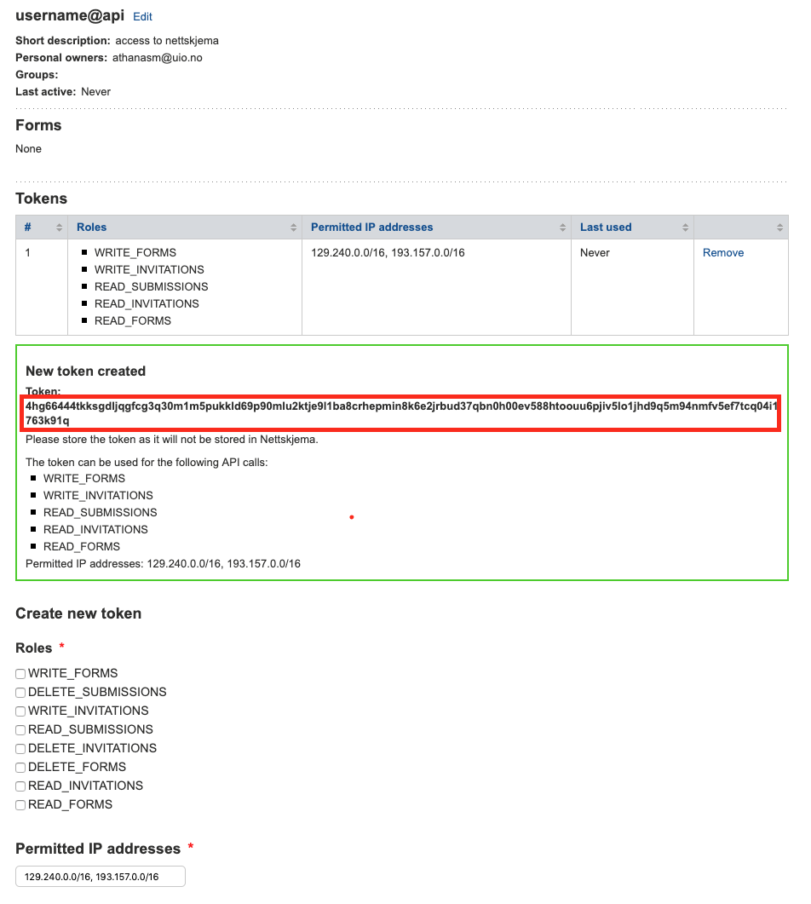

<!-- README.md is generated from README.Rmd. Please edit that file -->

# nettskjemar

<!-- badges: start -->

[](https://travis-ci.org/LCBC-UiO/nettskjemar)
[](https://codecov.io/gh/LCBC-UiO/nettskjemar?branch=master)
<!-- badges: end -->

The goal of nettskjemar is to …

## Installation

And the development version from [GitHub](https://github.com/) with:

``` r
# install.packages("remotes")
remotes::install_github("LCBC-UiO/nettskjemar")
```

## Setting up a connection to the Nettskjema API

To set up a connection to the Nettskjema API, you need to create an
api-user, and a token associated with this user. Use the
“nettskjema\_user\_create” function to be routed to the portal to set
this up.

``` r
library(nettskjemar)
#nettskjema_user_create()
```




## Example

Currently there are very few functions actually working in the package.
The most important, is the function that will download nettskjema
submission data and return them as a tibble (data.frame).

``` r
## basic example code
```

## Documentation

Package documentation can be found on the associated [GitHub
pages](https://lcbc-uio.github.io/nettskjemar/)
