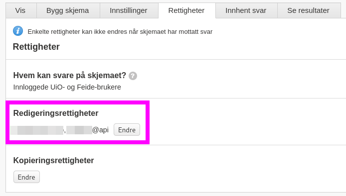

```{r, include = FALSE}
knitr::opts_chunk$set(
  collapse = TRUE,
  comment = "#>", 
  eval = FALSE
)
```


## Create an API user
To set up a connection to the Nettskjema API, you need to create an api-user, and a token associated with this user. 
The nettskjema api-user is different from your standard user that has access to nettskjema. 
This is a specific user that may access nettskjema through the API. 

Use the `nettskjema_user_create` function to be routed to the portal to set this up.

```{r, eval = TRUE}
library(nettskjemar)
```

```{r}
nettskjema_user_create()
```

Create an api user, I recommend using your uio user name or an UiO user group.
{width=100%}

## Create an API token
Click on the created username to access the token generation.
{width=100%}

Select which permissions the token should be allowed to have, and save to create the token.
Make sure that the IP addresses you want the token to be used from is in the list of ips at the bottom. 
If you don't know your current IP address, [google "what's my ip"](https://www.google.com/search?q=whats+my+ip&rlz=1C5CHFA_enNO891NO891&oq=whats+my+ip&aqs=chrome..69i57.1587j0j7&sourceid=chrome&ie=UTF-8).
Your API user access will not work if you do not add your IP address, and you will have to regenerate the token with the correct IP address if you don't ensure this.
If you are connecting from a mobile network (mobile hotspot or your home network is wireless), you should find you IPv6 address, rather than IPv4 (default). 

{width=100%}

Copy the token and return to RStudio (this example token has been deleted).
{width=100%}

## Add token to Renvironment
In R, you can now add this token to your `.Renviron` file. 
We recommend using a function from the [usethis]() package to edit your `.Renviron` file.

```{r}
usethis::edit_r_environ()
```

This will open the file and enable you to add information to it. 
You will need to add the nettskjema token as shows below.

```{bash}
NETTSKJEMA_API_TOKEN=paste_token_here
```

For it to take effect, you need your R session to restart. 
You may do so in RStudio by going to `Session` -> `Restart R session`, and by pressing `cmd/ctrl + shift + F10` on the keyboard.

By default, the functions in this package will look for a token named `NETTSKJEMA_API_TOKEN`, but you may save it at something else (or have multiple token), but you will need to make sure the nettskjema functions then have the `token_name` argument altered.

**OBS!**
All tokens are important to keep safe.
If you believe a token has been compromised in any way, delete it in the API user-portal and create a new one.


### Check token expiry date
The token is valid for 1 year. 
You can check the remaining time left a token is valid by

```{r}
nettskjema_token_expiry()
```

```
Token with name 'NETTSKJEMA_API_TOKEN' expires in 292 days.
[1] "2022-02-26"
```

## Add your API user to your form(s)
Whichever forms you want the API to have access to, you need to add your API user to the permissions of the form in the Nettskjema portal, like you would add another colleague to the form.

Go to nettskjema.no, navigate to the form you want your API user to have access to, go to the permissions tab, and add the user to the editing group.

```{r eval = TRUE, echo = FALSE, out.width="100%", fig.alt="Screen shot of the Nettskjema portal's permission tab for a form. Where you can see the editing group where the API user needs to be added" }

```


